# Studio Ghibli: Fact or Fantasy?

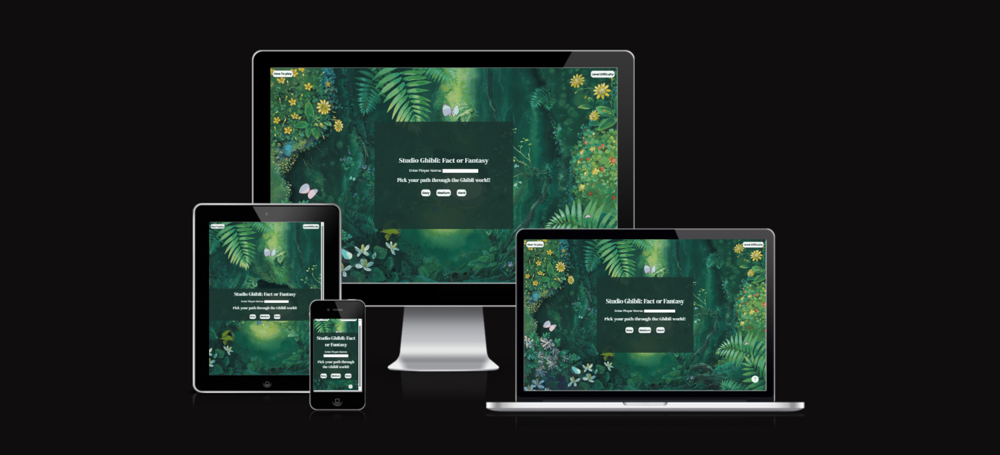

## Project Rationale

Studio Ghibli is a world renowned Japanese animation studio known for its beautifully crafted films, imaginative storytelling, and emotional depth!

This true or false quiz was created to celebrate the legacy and magic of Studio Ghibli, one of the most beloved and influential animation studios in the world. Whether you're a casual fan or a lifelong devotee, this quiz offers a fun way to test your knowledge and maybe even learn something new about the Ghibli world. ​With questions covering things like character lore, production details and hidden trivia, this quiz invites users to look beyond the screen and explore the artistry and real world influences behind Studio Ghibli's work.

### Target Audience

* Fans of Studio Ghibli films.
* Anime Enthusiasts, broader anime fans who may not know Ghibli’s full catalogue but appreciate the genre and storytelling style.​
* Pop Culture and Trivia Lovers, people who love quizzes and trivia games about an iconic franchise.

### Website Goals 

#### Business Goals

* To provide a fun and interactive true or false quiz to engage users.​
* Include different levels of difficulty  to challenge and test users​.
* Includes feedback if the user selects the right or wrong answer.​
* Keeps track of and displays the users score.​
* To create a quiz that appeals to Studio Ghibli fans. 

#### User Goals

* To be able to test my knowledge through relevant quiz questions.​
* To see what my score is as the quiz is completed. 
* For the website to be visual interesting and fun. 
* To receive feedback on the answer given, whether it is correct or incorrect. 

#### Developer Goals

* To create a visual interesting website that keeps users engaged with the content. ​
* A clear and consistent layout, structure and style.​
* An interactive website that responds to user actions and provides a positive interaction for the user.
### Development Planning

The project has been divided into smaller, manageable tasks using GitHub Projects to streamline the development process. Each task was created to address specific [user story](#user-stories) requirements and to ensure the project remains aligned with its goals. ​These tasks have been organised by priority, must have, should have and could have, this prioritization ensures that the key features are implemented first, allowing the website to meet its primary goals effectively.

### Key Features 
The existing features have been added as they achieve the goals of the user, business and developer within the chosen timeframe, which was a priority and the main goal when planning the project scope. The features have been explained in more detail and paired with screenshots of the website [here](#existing-features).

* **Difficulty Levels:** Easy, Medium, Hard (10 questions per level).
* **Landing Page:** Includes quiz title, username field, level selection, and start button.
* **Question Page:** Displays quiz questions depending on the level selected and uses tick/X buttons for for users to choose the answer.
* **Feedback:** Immediate response to correct or incorrect answers displayed on the same page as the question.
* **Information Bar:** This shows player name, score and difficulty level.
* **Thank You Page:** Shows final score and provides options to restart or play again.
* **404 Page:** This will direct users back to the homepage via a direct link. 

### Future Features
With the time constraints and scope of the project, the below features were not implemented but are future enhancements to add at a later date to improve and grow the website.
* An additional expert level.
* A leader board of other players scores.
* A countdown timer to add a challenge to the levels.

### Summary

The website achieves the goals outlined above, to provide a fun and interactive Studio Ghibli themed quiz that offers multiple difficulty levels to engage a wide range of users. It allows users to have fun and test personal knowledge of Studio Ghibli films and provides an interactive experience that responds smoothly to user input while also being visually interesting. The website provides a digital space for fans to test their knowledge and also learn about any knowledge gaps they may have, enouraging them to re-watch and enjoy the films again so they can return to the wesbite and try again! 

## User Stories 

**User Story 1**
* As a user I want to test my knowledge on all things Ghibli. 

**User Story 2**

* As a user I want to challenge and test my knowledge at different levels. 

**User Story 3** 

* As a user I want to keep track of my score when completing the quiz. 

**User Story 4**

* As a user I want to know when I get something correct or incorrect.

**User Story 5**

* As a user I would like the website to be engaging and fun to use. 

**User Story 6**

* As a user I want the website to be visually interesting and reflect what the website is about. 

## Design Choices

The website has been designed to be fun and engaging to encourage users to interact with the quiz while also capturing the whimsical feeling of the Studio Ghibli films.

#### Font Family

* I have chosen **DM Serif Display** for headings and titles as it is a fun and decorative font which matches the content of the website.
* I have chosen **Poppins** for the main text content as it is a rounded,clean and modern font which is easy to read and balances the fun font and it prevents the website from feeling too overwhelming.​

### Background and Colours 

* I have chosen a still image from the movie My Neighbor Totoro as my background image for the website. I have chosen this as it is one of the most popular Studio Ghibli films and the image won't distract from the content, the also image re-sizes well across all screen sizes. The image is from the [Studio Ghibli works collection of stills](https://www.ghibli.jp/works/chihiro/ "Link to Ghibli website") which is free to use. 

View the Background Image

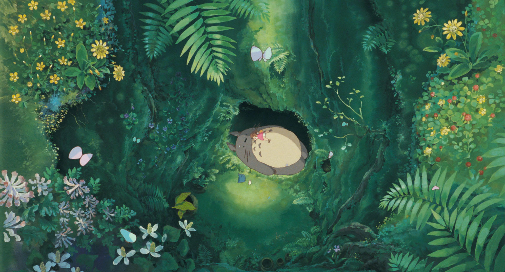

 

* The colours I have chosen have been picked from the background image to keep the wesbite styling consistent throughout. I have used  [Coolors](https://coolors.co/5c996e-1c342f-ffce85-f1f9f6-0e1b18 "Coolors palette") to create the colour palette. 

* I have also used the [Contrast Grid](https://contrast-grid.eightshapes.com/?version=1.1.0&background-colors=&foreground-colors=%235c996e%0D%0A%231c342f%0D%0A%23ffce85%0D%0Af1f9f6%0D%0A0e1b18%0D%0A&es-color-form__tile-size=compact&es-color-form__show-contrast=aaa&es-color-form__show-contrast=aa&es-color-form__show-contrast=aa18&es-color-form__show-contrast=dnp "Contrast Grid website") to check the possible colour combinations and to check whether they work well together, I have also used this to check that the contrast between the colours are suitable for the website.

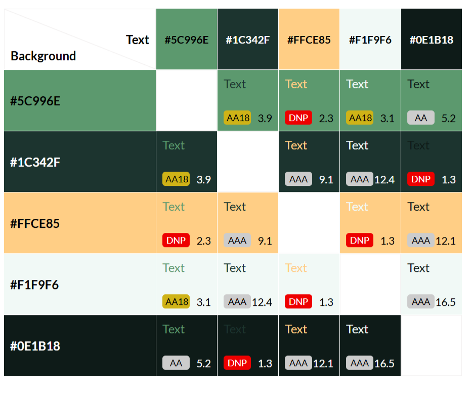

### Styling 

* The main container, as well as buttons, for the quiz will have rounded edges to keep with the fun element of the website. 

* The background colour of the quiz will be partially transparent so the background image will still be seen without distracting from the quiz content.

## Wireframes

The wireframes have been made using [Balsamiq](https://balsamiq.com/ "link to balsamiq"). The main three components of the website have been outlined and designed to provide a guide when building the website to ensure that all key features are included and to visualise how these features will appear across different devices. 

|                   | Desktop | Tablet | Mobile |
|-------------------|---------|--------|--------|
| Landing Page         |    |   |   |
| Questions         |    | 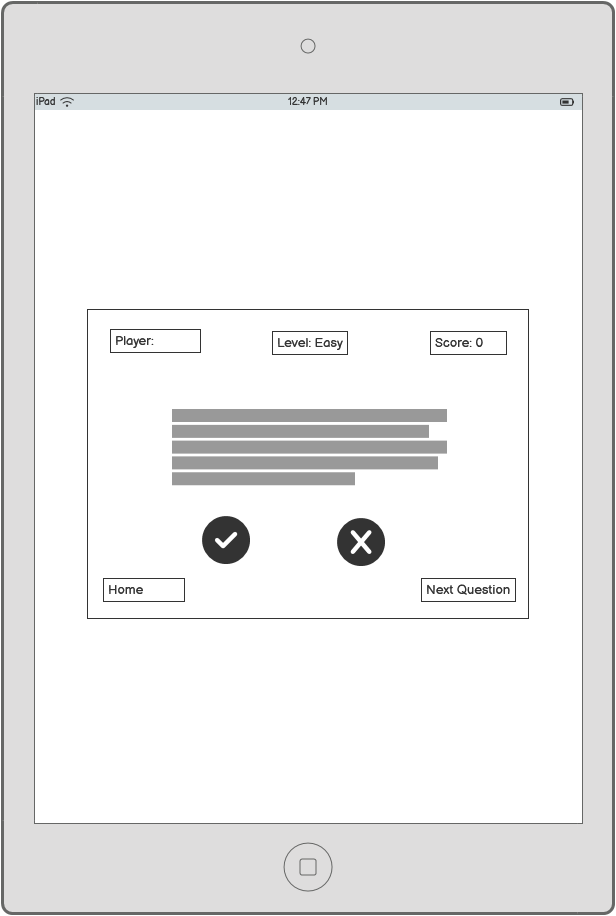   |     |
| Thank you message |    |    |   |

## Existing Features

**Level Options**

The website currently has three levels of difficulty for users to choose from so users can test and challenge their knowledge.
* **Easy**: Covers popular films and well-known characters.​
* **Medium**: Tests your knowledge of story details and lesser known films.​
* **Difficult**: Challenges even the most devoted Ghibli fans.

**Landing Page**

The website has a welcoming landing page that contains the name of the quiz, a player name input field, a start game button and a selection of difficulty levels for the user to select. The user must input their player name to start the quiz and will be prompted to do so if they try start the game without entering it, the user must also select the difficulty level before proceeding. 

**Question Page**

After clicking the start game button the user will be shown the questions page which will display the the question depending on the level selected. There are currently ten questions per level and the answer is either true or false. Once each questions is answered the next question will be displayed in its place.

**True or False Buttons**

Underneath the questions there are two buttons, one with a tick (true) and one with an X (false), these are a fun and interactive way to select a true or false answer. Once the user has clicked their choice a message will be displayed congratulating them or informing them of the correct answer.

**Current Game Information Bar**

Above the questions there is a bar that includes the players name, the current level difficulty and the score which keeps track of the correct answers as the user plays the quiz.

**Thank You Page**

Once the user has completed the quiz they will be shown a thank you message. Underneath the thank you message the user can see the score of the quiz they have just completed. There is also a button to end the game, which takes the user back to the home page and resets the player name. The second button is the option to play again, which keeps the player name and takes them back to select another level. 

**404 Page**

This will direct the user back to the home page via a link in the event they enounter a non-existent page. The message includes a refernce to the movies which has been added to add some fun to the 404 page. 

## Technologies Used 

### Languages 

* HTML 
* CSS 
* JavaScript

### Libraries and Framework
* [Google Fonts](https://fonts.google.com/ "Link to Google Fonts")
* [Fontawesome](https://fontawesome.com/ "Link to Fontawesome")
* [Icons8](https://icons8.com/icons/set/ghibli "Link to Icons8")

### Tools 

* [Github](https://github.com/ "Link to GitHub")
* [Balsamiq](https://balsamiq.com/ "Link to Balsamiq")
* [W3C HTML Validation Service](https://validator.w3.org/ "Link to W3C HTML")
* [W3C CSS Validation Service](https://jigsaw.w3.org/css-validator/ "Link to W3C CSS")
* [Responsive Design Checker](https://responsivedesignchecker.com/ "Link to Responsive Design Checker")
* [Am I Responsive](https://responsivedesignchecker.com/ "Link to Am I Responsive")
* [Coolors](https://coolors.co/ "Link to Coolers website")
* [WAVE Accessibility Tool](https://wave.webaim.org/ "Link to WAVE")
* [Contrast Grid](https://contrast-grid.eightshapes.com/?version=1.1.0&background-colors=&foreground-colors=%235c996e%0D%0A%231c342f%0D%0A%23ffce85%0D%0Af1f9f6%0D%0A0e1b18%0D%0A&es-color-form__tile-size=compact&es-color-form__show-contrast=aaa&es-color-form__show-contrast=aa&es-color-form__show-contrast=aa18&es-color-form__show-contrast=dnp "Contrast Grid website")
* [Keynote](https://www.keynotesupport.com/internet/special-characters-flowers-trees-leaves.shtml "Link to HTML flower icons")
* [Remove bg](https://www.remove.bg/ "Link website")

## Testing

### Bugs

| Bug                                                                                        | Status | Description                                                                                                                         | Resolve                                                                                                                   |
|--------------------------------------------------------------------------------------------|--------|-------------------------------------------------------------------------------------------------------------------------------------|---------------------------------------------------------------------------------------------------------------------------|
| Questions not displaying correctly when testing in the live environment and deployed site. | Fixed  | When running the showQuestion function the questions were displaying with object Object in front of them.                           | Used a template literal to display the questions correctly.                                                               |
| Error displayed in console, Cannot read properties of undefined (reading 'question')       | Fixed  | An error appeared when clicking through the questions, an extra click is needed to display thank you page after the last question.  | Developer error, the incorrect number was input as the question length.                                                   |
| Adding class "hide" would not hide the true or false icons                                 | Fixed  | When clicking either button the icons would remain on screen, instead of hiding to prevent the user changing their answer.          | Each button icon was put inside it's own span element which allowed the class hide to be applied correctly.               |
| True or false icons not appearing when the game restarts                                   | Fixed  | When testing the true and false buttons wouldn't consistently reappear when end game/play again was clicked to start a new game.    | Added the addTrueButton and addFalseButton function to the finish game function so they appear as expected for each game. |

### Mannual Tests

The website has been manually tested by the developer, this hands on approach to testing allows us to see that the website works as expected and meets the users needs, it also gives us an insight into how the user would experience the site. Manual testing can be less efficient than automated testing but more effective for UI-related tests needing human instinct.

* All levels of the quiz have been played to completion to ensure that the website is user friendy and that all questions are displayed correctly according to the level selected. 
* During the duration of the game no errors appear in the console at any point, this has been tested across all game levels.
* I have tried to start the game while leaving player name input blank to make sure the user can't proceed until the player name is entered and that they are prompted to do so. 
* The buttons on the site have all been manually tested and work as expected, displaying the correct section of the site to the user. 

### User Story Testing
| User Story                                                                                     | Result                                                                                                                                                                                                                                                                    | Pass | Evidence      |
|------------------------------------------------------------------------------------------------|---------------------------------------------------------------------------------------------------------------------------------------------------------------------------------------------------------------------------------------------------------------------------|------|---------------|
| As a user I want to test my knowledge on all things Ghibli                                     | The questions for the quiz are all relevant to Studio Ghibli, they are true or false responses so users can reply solely on their existing knowledge. There are 10 questions per level based on the films, production and lore.                                           | Pass | |
| As a user I want to challenge and test my knowledge at different levels.                       | Users can select one of the three difficulty levels before starting the quiz, the questions are different for each level and increase in difficulty depending on the level selected. Once a level has been played the user can start again and choose a different level.  | Pass | 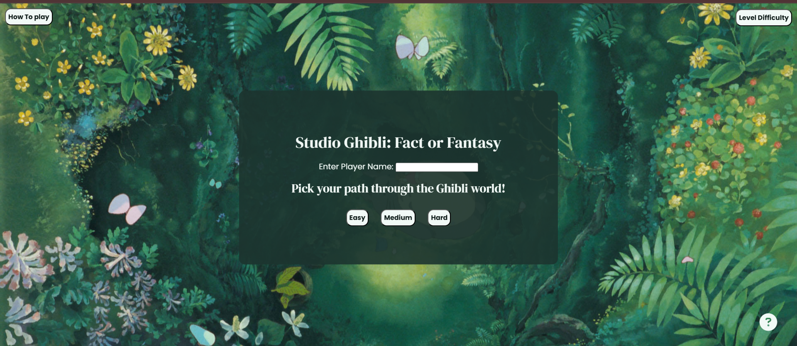 |
| As a user I want to keep track of my score when completing the quiz.                           | Once starting the game there is a score counter that updates for every answer the user gets correct. At the end of the quiz users can see their overall score.                                                                                                            | Pass | 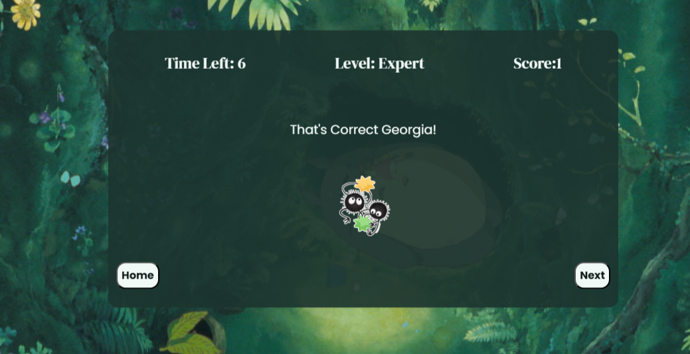 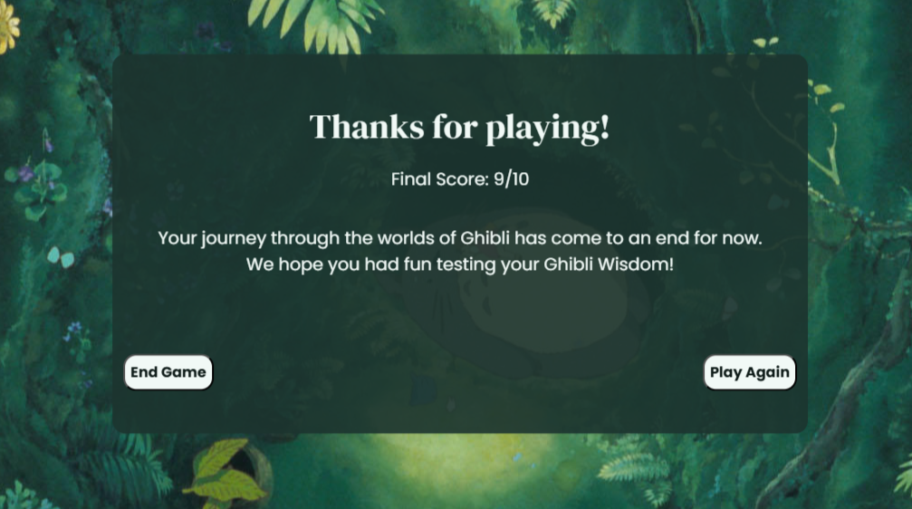 |
| As a user I want to know when I get something correct or incorrect.                            | A message appears to the user depending on whether they get the answer right or wrong, if the answer selected is wrong a response and the correct answer is displayed.                                                                                                    | Pass | 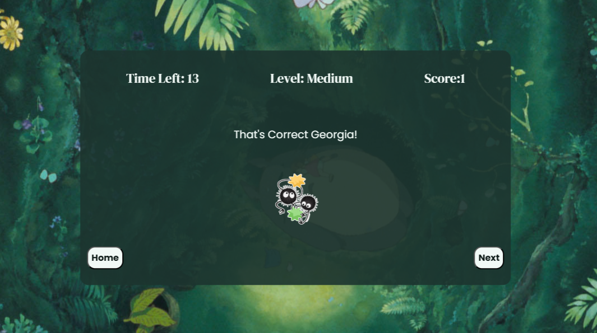 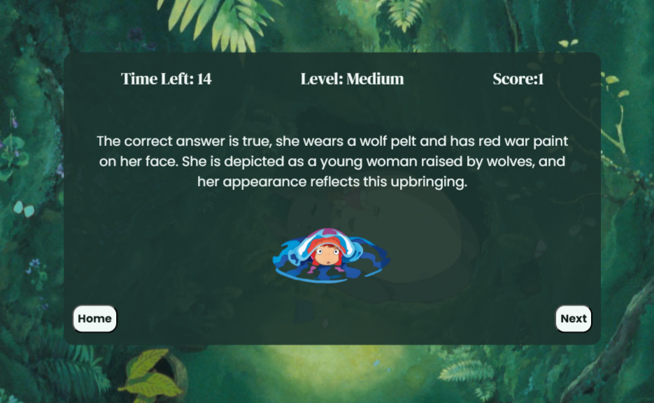|
| As a user I would like the website to be engaging and fun to use.                              | The buttons have a hover effect that changes the colour to match the colour of the flowers in the background image and the buttons grow in size to appear animated. The text content is kept brief so users remain engaged with the content.                              | Pass | 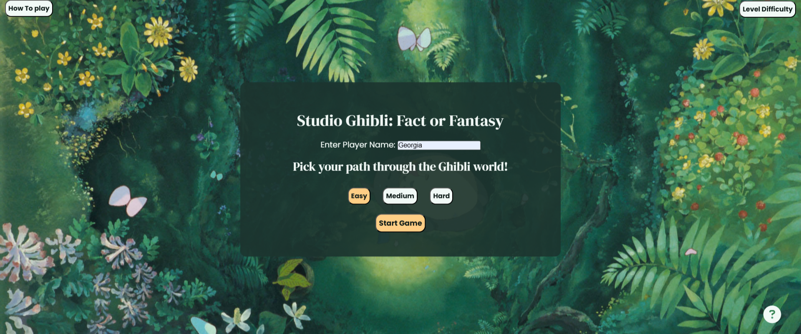|
| As a user I want the website to be visually interesting and reflect what the website is about. | The background image is a still from a popular Studio Ghibli movie and is colourful and high quality. The colours for the website have all been taken from this image and the font has been chosen to visually interesting.                                               | Pass | 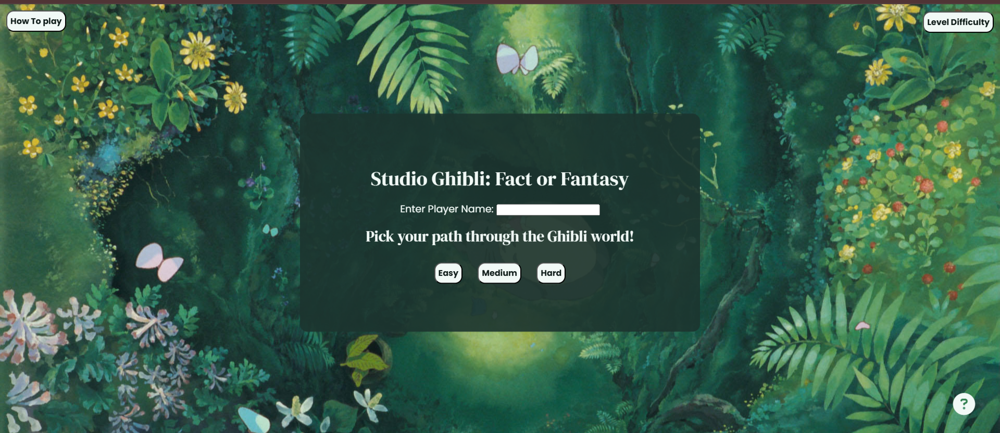|

### Responsiveness Testing

The website was deployed early in the development process so I could easily monitor how each change and addition would appear across all screen sizes, ensuring that the website would behave as expected. The website was designed using the mobile-first strategy to enhance user experience, to test the responsiveness I have used Chrome DevTools during the development process and have evaluated these changes across the devtools breakpoints. Each breakpoint has been examined for any layout, navigation, text or image concerns.

The website has also been tested using Google Chrome's Mobile simulator.

| Size    | Example Device     | Navigation | Content Placement | Image Appearance | Screenshot | Notes                                                                                  |
|---------|--------------------|------------|-------------------|------------------|------------|----------------------------------------------------------------------------------------|
| Small   | Samsung Galaxy s20 | Good       | Good              | Good             | 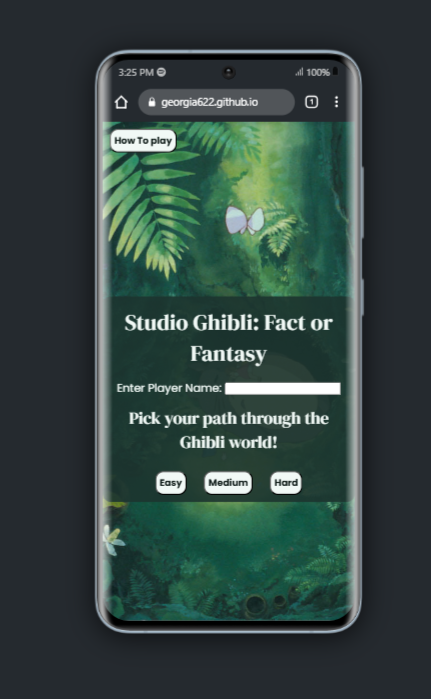     |                                                                                        |
| Small   | iPhone 11          | Good       | Good              | Good             | 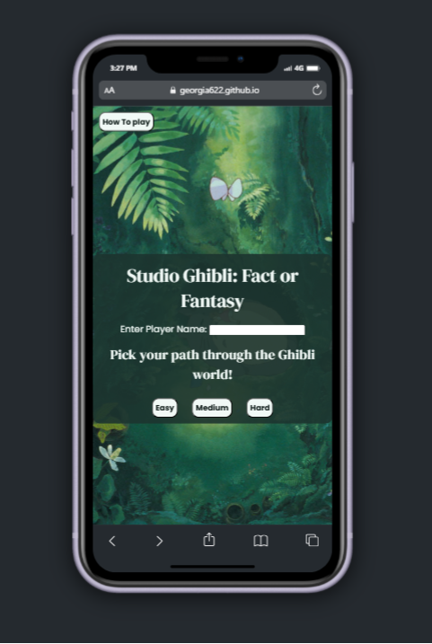  |                                                                                        |
| Small   | iPhone 14 PRO      | Good       | Good              | Good             | 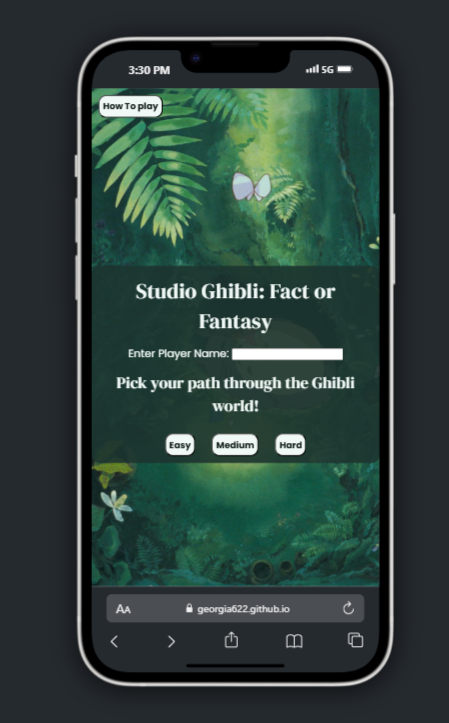  |                                                                                        |
| Medium  | iPad Mini          | Good       | Good              | Good             |   |                                                                                        |
| Medium  | Galaxy Tab S7      | Good       | Good              | Good             | 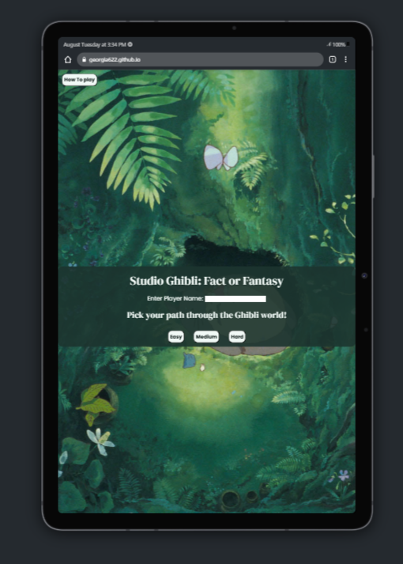 |                                                                                        |
| Large   | iPad PRO 11        | Good       | Good              | Good             | 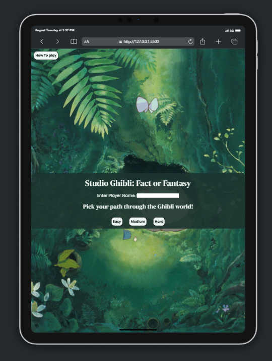  | Added media queries to change the display container size to fit the screen size better |
| X-Large | Macbook Air        | Good       | Good              | Good             |     |                                                                                        |

### Automated Testing 

Automated testing has been used to fully test the website to ensure there are no errors or major problems in the code. It is more reliable than mannual testing but doesn't test for the user experience, which is why I have chosen to use both to test. Using automated testing means that any erros are quickly caught and it can catch any errors mannual testing may have missed. 

#### Code Validation 

I have tested my files index.html and 404.html using [W3C HTML Validation Service](https://validator.w3.org/ "Link to W3C HTML"). The both files passed without any errors.
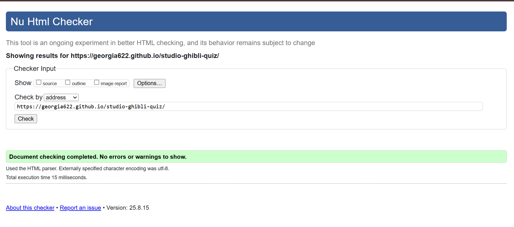

I have tested my CSS file using [W3C CSS Validation Service](https://jigsaw.w3.org/css-validator/ "Link to W3C CSS"). There were no errors found in the file.

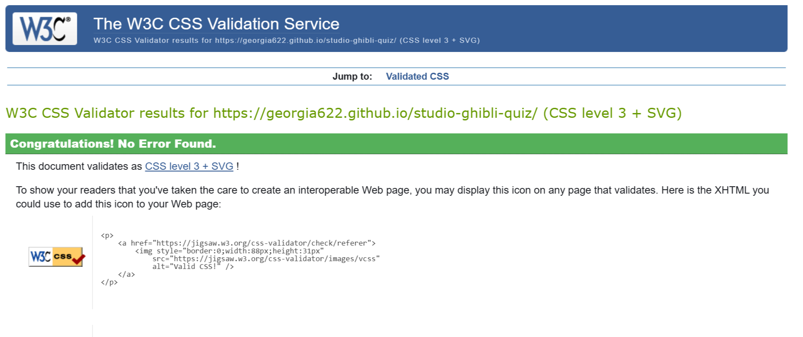

#### Accessibility Testing 

I have tested the website using  [WAVE Accessibility Tool](https://wave.webaim.org/ "Link to WAVE"), this website checks the websites accessibility and helps authors make their web content more accessible. There were no errors found. 

#### Lighthouse Testing 

The website has been tested using Lighthouse testing in ChromeDevTools. This tool tests for: 

* Performance
* Accessibility
* Best practices
* SEO

Test results for desktop on Lighthouse Chrome:

 

Test results for mobile on Lighthouse Chrome:

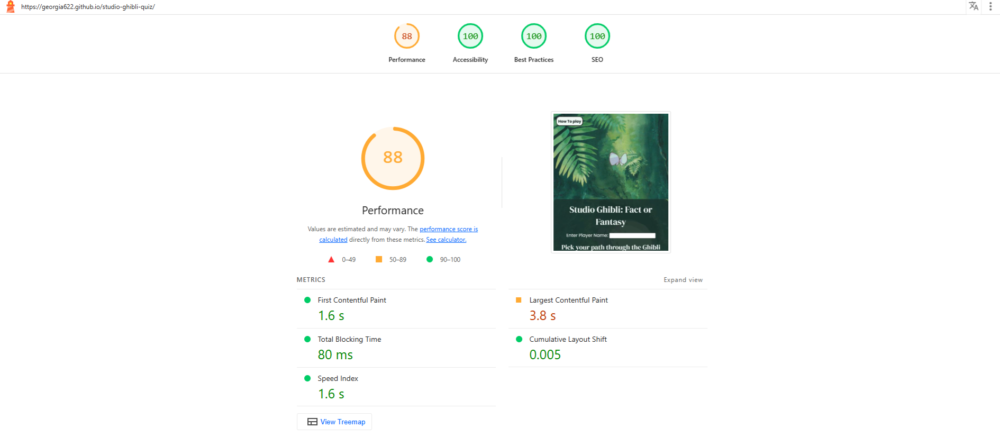 

## Deployment

Studio Ghibli Fact or Fantasy has been deployed via GitHub pages and is now live at https://georgia622.github.io/studio-ghibli-quiz/

### Deployment Process

The project was deployed using these steps: 

* In the [GitHub repository](https://github.com/georgia622/studio-ghibli-quiz), navigate to the "Settings" tab.
* In Settings, click on the "Pages" link from the menu on the left.
* From the "Build and deployment" section, click the drop-down called "Branch", and select the **main** branch, then click "Save".
* The page will be automatically refreshed with a detailed message display to indicate the successful deployment.
* Allow up to 5 minutes for the site to fully deploy.

The live link can be found on [GitHub Pages](https://github.com/georgia622/studio-ghibli-quiz).

### Local Development

This project can be cloned or forked in order to make a local copy on your own system.

### How to clone the project

You can clone the repository by following these steps:

1. Go to the [GitHub repository](https://github.com/georgia622/studio-ghibli-quiz).
2. Locate and click on the green "Code" button at the very top, above the commits and files.
3. Select whether you prefer to clone using "HTTPS", "SSH", or "GitHub CLI", and click the "copy" button to copy the URL to your clipboard.
4. Open "Git Bash" or "Terminal".
5. Change the current working directory to the location where you want the cloned directory.
6. In your IDE Terminal, type the following command to clone the repository:
	- `git clone https://github.com/georgia622/studio-ghibli-quiz.git`
7. Press "Enter" to create your local clone.

Alternatively, if using Gitpod, you can click below to create your own workspace using this repository.

**Please Note**: in order to directly open the project in Gitpod, you should have the browser extension installed. A tutorial on how to do that can be found [here](https://www.gitpod.io/docs/configure/user-settings/browser-extension).

### How to Fork the Project

By forking the GitHub Repository, you make a copy of the original repository on our GitHub account to view and/or make changes without affecting the original owner's repository. You can fork this repository by using the following steps:

1. Log in to GitHub and locate the [GitHub Repository](https://github.com/georgia622/studio-ghibli-quiz).
2. At the top of the Repository, just below the "Settings" button on the menu, locate and click the "Fork" Button.
3. Once clicked, you should now have a copy of the original repository in your own GitHub account!

### Local VS Deployment

There are no remaining major differences between the local version when compared to the deployed version online.

## Credits

### Background Image and Images

* [Studio Ghibli Stills Collection, My Neighbour Totro](https://www.ghibli.jp/works/totoro/ "Link to website")
* [Studio Ghibli Transparent Ponyo](https://www.clipartmax.com/middle/m2i8G6Z5A0N4K9b1_ponyowater-studio-ghibli-transparent-ponyo/ "Link to website")
* [Animated Black Soot Sprites Holding Stars](https://www.cleanpng.com/png-studio-ghibli-japanese-animation-hayao-miyazaki-ba-8030426/ "Link to website")

### Code help and tutorials

* [30 seconds of code](https://www.30secondsofcode.org/*/ "Link to website")
* [Free code camp](https://www.freecodecamp.org/news/form-validation-with-html5-and-javascript/ "Link to website")
* [Great Stack Dev](https://greatstack.dev/ "Link to website")

### Quiz Content

* The questions for this quiz were created using [ChatGPT](https://chatgpt.com/ "Link to Chatgpt"), all questions were fact checked before being included in the quiz.

### Feedback and help 

* [Simen Daehlin](https://github.com/Eventyret "Simen Daehlin")
* [Code Institute Slack Channel](https://app.slack.com/client/T0L30B202/C01EDCJBKNU "Code Institute")