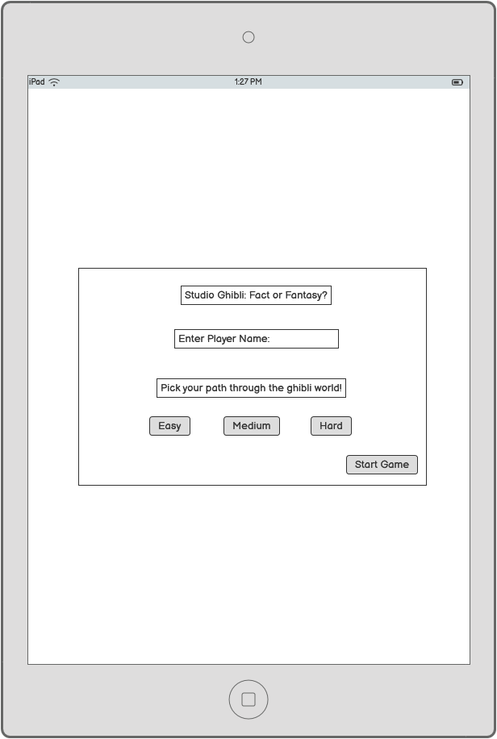
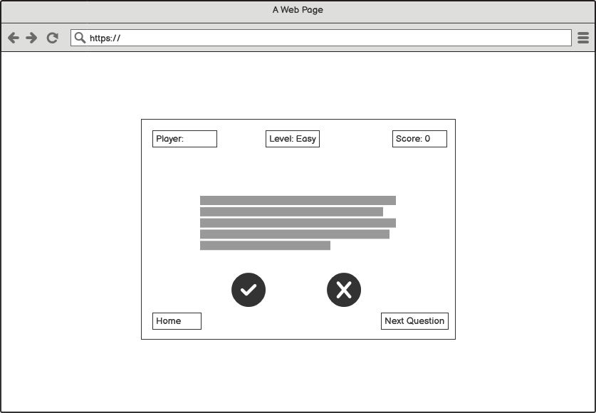

# Studio Ghibli: Fact or Fantasy?

## Project Rationale

Studio Ghibli is a world renowned Japanese animation studio known for its beautifully crafted films, imaginative storytelling, and emotional depth. 

This true or false quiz was created to celebrate the legacy and magic of Studio Ghibli, one of the most beloved and influential animation studios in the world. Whether you're a casual fan or a lifelong devotee, the quiz offers a fun way to test your knowledge and maybe even learn something new about the Ghibli universe.​With questions covering character lore, production details, and hidden trivia, the quiz invites participants to look beyond the screen and explore the artistry and real world influences behind Studio Ghibli's work.

### Target Audience

* Fans of Studio Ghibli.
* Anime Enthusiasts, broader anime fans who may not know Ghibli’s full catalogue but appreciate the genre and storytelling style.​
* Pop Culture and Trivia Lovers, people who love quizzes and trivia games about an iconic franchise.

### Website Goals 

#### Business Goals

* To provide a fun and interactive true or false quiz to engage users.​
* Include different levels of difficulty  to challenge and test users​.
* Includes feedback if the user selects the right or wrong answer.​
* Keeps track of and displays the users score.​
* To create a quiz that appeals to Studio Ghibli fans. 

#### User Goals

* To be able to test my knowledge through relevant quiz questions.​
* To see what my score is as the quiz is completed. 
* For the website to be visual interesting and fun. 
* To receive feedback on the answer given, whether it is correct or incorrect. 

#### Developer Goals

* To create a visual interesting website that keeps users engaged with the content. ​
* A clear and consistent layout, structure and style.​
* An interactive website that responds to user actions and provides a positive interaction for the user.

### Key Features 
The existing features have been added as they achieve the goals of the user, business and developer within the chosen timeframe, which was a priority and the main goal when planning the project scope. The features have been explained in more detail and paired with screenshots of the website [here](#existing-features).

* **Difficulty Levels:** Easy, Medium, Hard (10 questions per level).
* **Landing Page:** Includes quiz title, username field, level selection, and start button.
* **Question Page:** Displays quiz questions depending on the level selected and uses tick/X buttons for for users to choose the answer.
* **Feedback:** Immediate response to correct or incorrect answers displayed on the same page as the question.
* **Information Bar:** This shows player name, score and difficulty level.
* **Thank You Page:** Shows final score and provides options to restart or play again.

### Future Features
With the time constraints and scope of the project, the below features were not implemented but are future enhancements to add at a later date to improve and grow the website.
* An additional expert level.
* A leader board of other players scores.
* A countdown timer to add a challenge to the levels.

### Summary

The website achieves the goals outlined above, to provide a fun and interactive Studio Ghibli themed quiz that offers multiple difficulty levels to engage a wide range of users. It allows users to have fun and test personal knowledge of Studio Ghibli films and provides an interactive experience that responds smoothly to user input while also being visually interesting.

## User Stories 

**User Story 1**
* As a user I want to test my knowledge on all things Ghibli. 

**User Story 2**

* As a user I want to challenge and test my knowledge at different levels. 

**User Story 3** 

* As a user I want to keep track of my score when completing the quiz. 

**User Story 4**

* As a user I want to  know when I get something correct or incorrect.

## Design Choices

The website has been designed to be fun and engaging to encourage users to interact with the quiz while also capturing the whimsical feeling of the Studio Ghibli films.

#### Font Family

* I have chosen **Gravitas One** for headings and titles as it is a fun,bold and decorative font which matches the content of the website.
* I have chosen **Poppins** for the main text content as it is a rounded,clean and modern font which is easy to read and balances the fun font and it stops the website from feeling too overwhelming.​

### Background and Colours 

* I have chosen a still image from the movie Spirited Away as my background image for the website. I have chosen this as it is one of the most popular Studio Ghibli films, and the image won't distract from the content as the colours are more muted. The image is from the [Studio Ghibli works collection of stills](https://www.ghibli.jp/works/chihiro/ "Link to Ghibli website") which is free to use. 

View the Background Image

 

* The colours I have chosen have been picked from the background image to keep the wesbite styling consistent throughout. I have used  [Coolors](https://coolors.co/e64a43-73875e-516161-40585f-2a2623-f1e8de "Coolors palette") to create the colour palette. 

* I have also used the [Contrast Grid](https://contrast-grid.eightshapes.com/?version=1.1.0&background-colors=&foreground-colors=%23f1e8de%0D%0A%232a2623%0D%0A%2340585f%0D%0A%23516161%0D%0A%2373875e%0D%0A%23e64a43%0D%0A&es-color-form__tile-size=compact&es-color-form__show-contrast=aaa&es-color-form__show-contrast=aa&es-color-form__show-contrast=aa18&es-color-form__show-contrast=dnp "Contrast Grid website") to check the possible colour combinations and to check whether they work well together, I have also used this to check that the contrast between the colours are suitable for the website.

### Styling 

* The main container, as well as buttons, for the quiz will have rounded edges to keep with the fun element of the website. 

* The background colour of the quiz will be partially transparent so the background image will still be seen without distracting from the quiz content.

## Wireframes

The wireframes have been made using [Balsamiq](https://balsamiq.com/ "link to balsamiq").

|                   | Desktop | Tablet | Mobile |
|-------------------|---------|--------|--------|
| Landing Page         |    |   |   |
| Questions         |    |    |     |
| Thank you message |    |    |   |

## Existing Features

**Level Options**

The website currently has three levels of difficulty for users to choose from so users can test and challenge their knowledge.
* **Easy**: Covers popular films and well-known characters.​
* **Medium**: Tests your knowledge of story details and lesser known films.​
* **Difficult**: Challenges even the most devoted Ghibli fans.

**Landing Page**

The website has a welcoming landing page that contains the name of the quiz, a player name input field, a start game button and a selection of difficulty levels for the user to select. The user must input their player name to start the quiz and will be prompted to do so if they try start the game without entering it, the user must also select the difficulty level before proceeding. 

**Question Page**

After clicking the start game button the user will be shown the questions page which will display the the question depending on the level selected. There are currently ten questions per level and the answer is either true or false. Once each questions is answered the next question will be displayed in its place.

**True or False Buttons**

Underneath the questions there are two buttons, one with a tick (true) and one with an X (false), these are a fun and interactive way to select a true or false answer. Once the user has clicked their choice a message will be displayed congratulating them or informing them of the correct answer.

**Current Game Information Bar**

Above the questions there is a bar that includes the players name, the current level difficulty and the score which keeps track of the correct answers as the user plays the quiz.

**Thank You Page**

Once the user has completed the quiz they will be shown a thank you message. Underneath the thank you message the user can see the score of the quiz they have just completed. There is also a button to end the game, which takes the user back to the home page and resets the player name. The second button is the option to play again, which keeps the player name and takes them back to select another level. 
## Technologies Used 

### Languages 

* HTML 
* CSS 
* JavaScript

### Libraries and Framework

### Tools 

* [Github](https://github.com/ "Link to GitHub")
* [Balsamiq](https://balsamiq.com/ "Link to Balsamiq")
* [W3C HTML Validation Service](https://validator.w3.org/ "Link to W3C HTML")
* [W3C CSS Validation Service](https://jigsaw.w3.org/css-validator/ "Link to W3C CSS")
* [Responsive Design Checker](https://responsivedesignchecker.com/ "Link to Responsive Design Checker")
* [Am I Responsive](https://responsivedesignchecker.com/ "Link to Am I Responsive")
* [Coolors](https://coolors.co/ "Link to Coolers website")
* [WAVE Accessibility Tool](https://wave.webaim.org/ "Link to WAVE")
